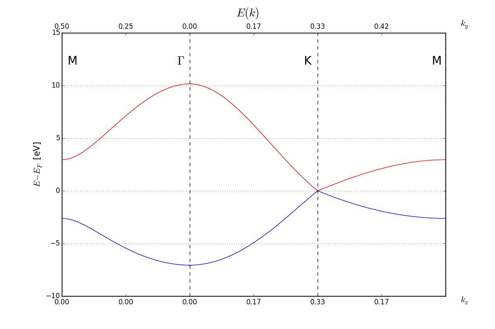
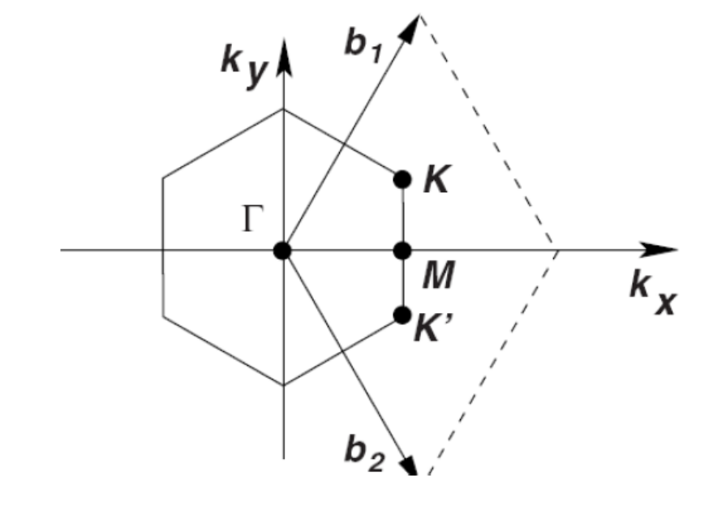

# Bands of Graphene (using only $\\ p_z \\$ states)

/

Vectors $k_x$ and $k_y$ are described in a basis of $b_1$ and $b_2$ vector on a picture below. Band structure was evaluated on path M-$\Gamma$-K-M.

/
